# Hi 👋, I'm Jai Kishan Kumar

### MERN Stack Developer | Passionate about Building Scalable Web Applications

 

- 💻 I'm currently working with the **MERN Stack**
- 🌱 Currently exploring **DevOps (AWS, Nginx, Deployment Automation)** to level up my full-stack workflow
- 🔭 Recent Projects: [Employee Attendance System](https://office.battlefiesta.in), [BattleFiesta](https://battlefiesta.in), [Accusoft Expense Manager](https://accusoft.battlefiesta.in).
- 💬 Ask me about **Web Development(MERN)** 
- ⚡ Fun Fact: I’m from a **non-IT background**, but code is now my favorite language!

 

## 🛠️ Tech Stack

 

  

 

## 📊 GitHub Stats

 

 

  

  
  
  
  
  

 

  

 

